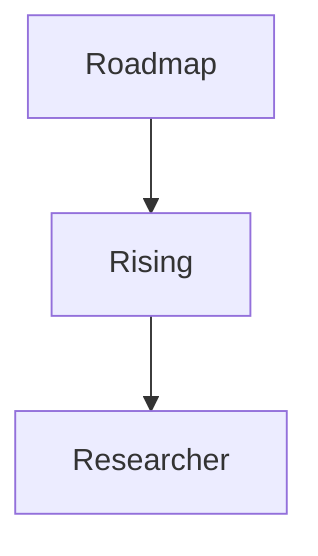

# 🇸🇩 SAIR – Sudanese Artificial Intelligence Research 

**Founder & Maintainer:** Mohammed Awad Ahmed (Silva)
**Course:** Practical Introduction to ML/DL Systems
**Status:** 🚀 First course started

---

## **💡 What is SAIR?**

SAIR (*السير* – “walking on a road” in Arabic) is a **Sudanese AI initiative** designed to educate, empower, and elevate local talent in **Artificial Intelligence**.

This repository is the **central companion** to our courses, lectures, and projects. It guides learners from **basic ML/DL concepts** to **state-of-the-art AI systems**, fostering a vibrant AI community in Sudan.

---

## **🌟 Vision**

SAIR exists to:

* ✅ **Educate:** Build foundational knowledge and advanced expertise in AI.
* ✅ **Empower:** Nurture Sudanese AI enthusiasts through mentorship and community.
* ✅ **Innovate:** Advance research and real-world applications locally and globally.
* ✅ **Collaborate:** Connect learners, researchers, and professionals.

> “AI is the future — let’s make Sudan part of it.”

---

## **🚦 Roadmap**

SAIR’s journey is organized into **three progressive pillars**:

### 1️⃣ **Roadmap**

* 📘 Structured learning path with lectures and exercises.
* 🎯 Build strong ML/DL foundations.
* 🛠️ Hands-on coding and guided projects.

### 2️⃣ **Rising**

* 🔍 Intermediate AI projects to apply concepts.
* 💡 Mini capstones and coding challenges.
* 🌐 Develop confidence in real-world applications.

### 3️⃣ **Researcher**

* 🧠 Advanced research projects & SOTA AI systems.
* 🤖 Deep dive into LLMs, CV, RL, and multimodal AI.
* 📄 Community research papers and collaborative experiments.

---

---

## **📈 Badges & Status**

---

## **🎓 How to Participate**

1. **Learn** – Follow the roadmap materials and exercises.
2. **Build** – Contribute to Rising projects or create your own.
3. **Research** – Collaborate on advanced experiments in the Researcher section.
4. **Share** – Document your learning and submit PRs to enrich the community.

---

## **📊 Roadmap Diagram**

*Visual representation of the journey: Roadmap → Rising → Researcher.*

---

## **🤝 Join Us**

> “SAIR is more than a repository — it’s a movement to place Sudan at the forefront of AI innovation.”

