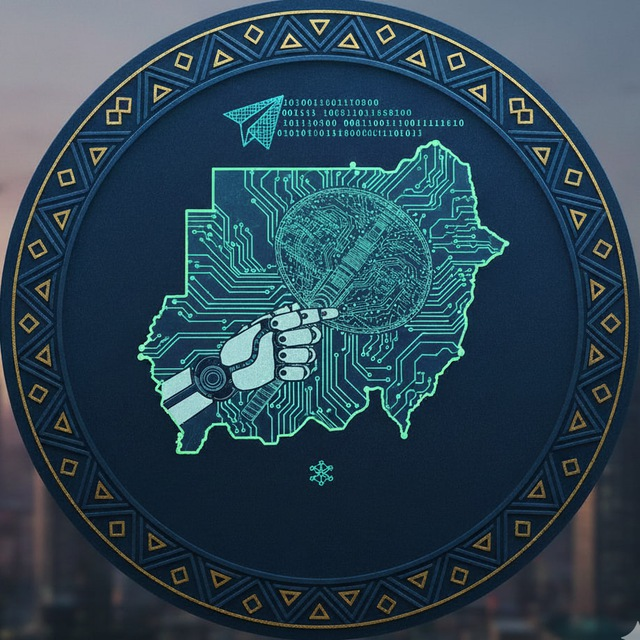

# **1️⃣ Main Repository README – SAIR**

```markdown
# 🇸🇩 SAIR – Sudanese Artificial Intelligence Research



**Founder & Maintainer:** Mohammed Awad Ahmed (Silva)  
**Course:** Practical Introduction to ML/DL Systems  
**Status:** 🚀 Active Courses & Community  
**License:** MIT | **Community:** [](https://t.me/+jPPlO6ZFDbtlYzU0)

---

## 💡 What is SAIR?

**SAIR** (*السير* – "walking on a road" in Arabic) is a **community-driven Sudanese AI initiative** to educate, empower, and elevate local talent in **Artificial Intelligence and Machine Learning**.

This repository is the **central hub** for courses, hands-on projects, and collaborative research. Learners are guided from **foundational ML/DL concepts** to **state-of-the-art AI systems**, building a vibrant AI community in Sudan.

### **Who is this for?**
* 🎓 Students learning AI from scratch  
* 💼 Professionals seeking career transitions  
* 🧠 Researchers exploring advanced topics  
* 🌍 Enthusiasts passionate about AI innovation  

**Why SAIR matters:** Sudanese talent deserves access to **free, high-quality AI education, mentorship, and opportunities**.

---

## 🌟 Vision & Mission

### **Vision**
*"AI is the new electricity — let's make Sudan a leader in it."*

### **Mission**
SAIR exists to:
- ✅ **Educate** – Foundational & advanced AI/ML/DL courses  
- ✅ **Empower** – Mentorship, community, and career guidance  
- ✅ **Innovate** – Local research and real-world AI applications  
- ✅ **Collaborate** – Connect learners, researchers, and professionals  

---

## 🚦 Learning Pathways

SAIR’s journey is structured in **three pillars**:

```

Foundations → Application → Research

````

| Phase          | Focus & Skills                       |
| -------------- | ------------------------------------ |
| **Roadmap**    | Python, ML fundamentals, first model |
| **Rising**     | Neural networks, NLP, CV, deployment |
| **Researcher** | Advanced LLMs, CV, RL, SOTA research |

**Start with the first module:** [📈 Regression Module – Full README](Regression/README.md)

---

## 💻 Tech Stack & Tools

**Core Technologies:**

[](https://www.python.org/)  
[](https://pytorch.org/)  
[](https://www.tensorflow.org/)  
[](https://huggingface.co/)  
[](https://github.com/google/jax)

**Deployment & Production:**

[](https://streamlit.io/)  
[](https://fastapi.tiangolo.com/)  
[](https://www.docker.com/)  
[](https://kubernetes.io/)

**Experiment Tracking & Management:**

[](https://mlflow.org/)  
[](https://wandb.ai/)

**Infrastructure & Data:**

[](https://developer.nvidia.com/cuda-toolkit)  
[](https://www.linux.org/)  
[](https://www.postgresql.org/)  
[](https://www.mongodb.com/)

**Specialized Domains:**

[](https://opencv.org/)  
[](https://docs.ros.org/en/foxy/)  
[](#)

---

## ⚡ Quick Start

### **Prerequisites**
* Python ≥ 3.11  
* Git  
* Terminal / CLI  
* Code editor (VS Code, PyCharm, etc.)  

### **Installation**
Clone the repo and install dependencies with `uv`:

```bash
git clone https://github.com/silvaxxx1/SAIR.git
cd SAIR
uv sync
````

Activate the environment:

```bash
uv venv
source .venv/bin/activate  # Windows: .venv\Scripts\activate
```

---

## 🎓 Current Courses

### **1️⃣ Regression Module (First Module)**

Build your first end-to-end ML project with:

* **Lectures 1–3:** Linear & polynomial regression, model evaluation, deployment
* **Exercises & Assignments** for hands-on learning
* **Streamlit App:** Interactive predictions & visualization
* **Capstone Projects:** Showcase your work in GitHub

**Module README:** [Regression/README.md](Regression/README.md)

---

## 📝 Contributing

We welcome contributions!

**Ways to Help:**

* 🐛 Report bugs or issues
* 📚 Improve documentation
* 🎥 Create tutorials or videos
* 🛠 Build and share projects
* 👥 Mentor newcomers

**GitHub Workflow:**

1. Fork the repo
2. Create a branch
3. Add notebooks, improvements, or modules
4. Submit a Pull Request

---

## 🤝 Community & Telegram

Join our **active AI community**:
[](https://t.me/+jPPlO6ZFDbtlYzU0)

Engage with learners, mentors, and researchers. Ask questions, share projects, and grow together.

---

## 🔥 Get Started Now

1. ⭐ Star this repo
2. 📖 Explore the [Regression Module](Regression/README.md)
3. 🚀 Build, learn, and contribute
4. 💬 Join our [Telegram community](https://t.me/+jPPlO6ZFDbtlYzU0)

> *“The best way to learn AI is to build with it.”* — SAIR Community

---

**Made with ❤️ by the SAIR Community**
*Empowering Sudan. Advancing AI. Changing the Future.*

